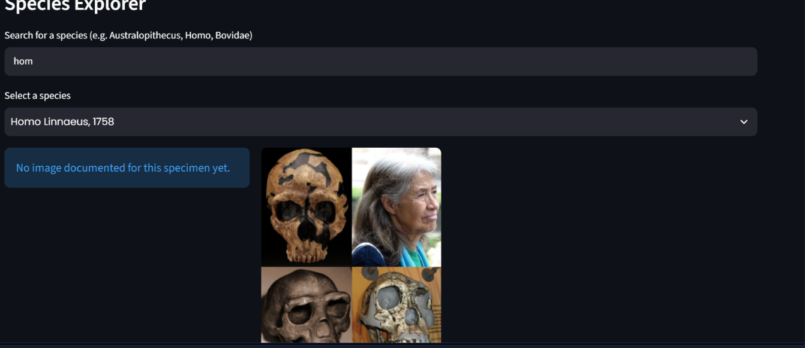
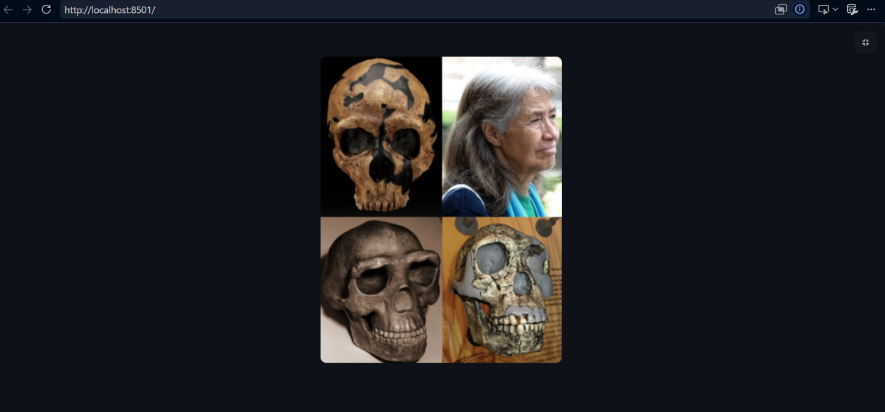
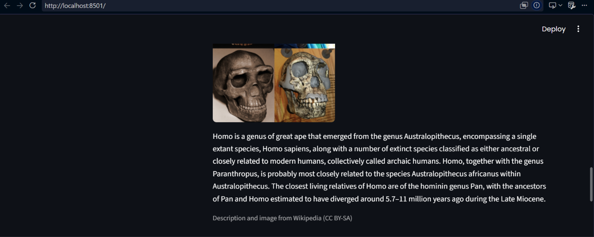
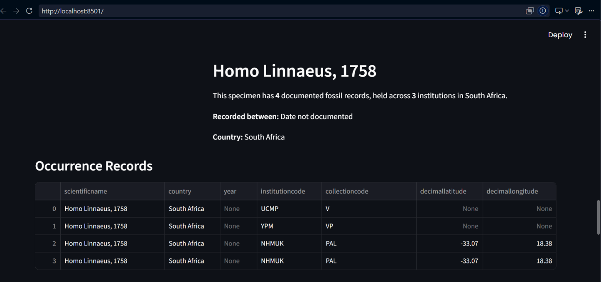

# 🦴 PaleoVault
WTC-CU8HFR7P

### An end-to-end data engineering pipeline exploring South African fossil occurrence data

[]()
[]()
[]()
[]()
[]()

PaleoVault extracts real fossil specimen data from the Global Biodiversity Information Facility (GBIF), cleans and validates it rigorously, loads it into a PostgreSQL database, and presents it through an interactive dashboard — complete with charts, an interactive map, and a Wikipedia-enriched species explorer.


---

## 📖 What Is PaleoVault?

PaleoVault is a data engineering project that answers a simple question: **what does South Africa's fossil record actually look like, according to the world's largest open biodiversity database?**

It takes raw, messy, real-world scientific data — fossil specimen records scattered across 42 different museums and universities worldwide — and turns it into something anyone can explore: a live, searchable dashboard showing where fossils were found, which institutions hold them, how discovery activity has changed over time, and what's actually known about each species.

### Purpose

This project exists to demonstrate a complete, real-world data engineering workflow  not a toy example, but an actual pipeline handling actual imperfect data: missing values, invalid coordinates, inconsistent formatting, and the reality that no single data source tells the whole story. Every cleaning and validation decision made along the way is deliberate and documented, not just "made to work."

### Who Can Use This?

- **Paleoanthropologists and researchers**, quickly see which South African institutions hold specimens of a given species, cross-reference discovery years, and identify gaps in geographic or temporal coverage without manually searching GBIF's raw interface
- **Museum and collection curators** ,get a consolidated view of how their institution's holdings compare to others, and spot data quality issues (missing coordinates, unnamed specimens) worth correcting at the source
- **Students and educators in paleontology or biodiversity science** — explore real specimen data interactively, without needing to write code or query a database directly
- **Data engineers and developers** — reference implementation for building a full pipeline (API → cleaning → PostgreSQL → analysis → dashboard) around a real, messy, public scientific dataset

### What You Can Do With It

- Browse aggregate trends: fossil records by year, by institution, by data quality
- Explore individual species: search by name, view a Wikipedia-style profile with description, image, and specimen locations
- Inspect the underlying data quality decisions and reasoning (documented below and throughout the code)
- Reuse or extend the pipeline for a different country, taxon, or data source entirely — the extraction and cleaning logic is written to be adaptable, not hardcoded to this one use case

---
## Preview of what the streamlit project looks like:








---

## 🎯 What This Project Demonstrates

| Skill | Where |
|---|---|
| API extraction with retry/error handling | `gbif_API.py` |
| Data cleaning, validation & data quality flagging | `gbif_API.py` |
| Relational database design & self-provisioning schema | `load_to_db.py` |
| SQL analysis & aggregation | `analysis.sql`, `queries.py` |
| Interactive data visualization | `dashboard.py` |
| Third-party API integration (Wikipedia) | `queries.py` |
| Secure configuration management | `.env` + `python-dotenv` |
| Containerized infrastructure | `docker-compose.yml` |
| Automated testing | `test_basic.py` |

---

## 🖥️ Dashboard Features

- 📊 **Summary Stats** => total records, unique species, contributing institutions
- 📈 **Records by Year** => fossil record activity across 74+ years
- 🏛️ **Records by Institution** => which museums/universities hold the most South African fossil data
- 🗺️ **Fossil Locations Map** => interactive map of every geographically valid record
- 🔍 **Species Explorer** => search any species and view a Wikipedia-style profile: live description and image (pulled from Wikipedia's API), GBIF specimen media (when available), occurrence records, and a dedicated location map

---

## 🏗️ Architecture
GBIF Occurrence API

│

▼

Python Extraction & Cleaning (gbif_API.py)

│

▼

clean_fossil_records.csv

│

▼

PostgreSQL Database (load_to_db.py)

(local install OR Docker)

│

▼

SQL Analysis (analysis.sql / queries.py) 

│

▼

Streamlit Dashboard (dashboard.py)

│

├── Plotly → charts

├── Folium → interactive maps

└── Wikipedia API → species descriptions & images


---

## 🛠️ Tech Stack

**Core:** Python 3.12 · PostgreSQL 16 · Pandas · psycopg2

**Dashboard:** Streamlit · Plotly · Folium · streamlit-folium

**Infrastructure:** Docker & Docker Compose · python-dotenv

**Testing:** pytest

**External APIs:** GBIF Occurrence API · Wikipedia REST API

---

## 📊 The Data

**Source:** [GBIF Occurrence API](https://www.gbif.org/developer/occurrence), filtered for:
- Country: **South Africa**
- Basis of Record: **Fossil specimens**

**Dataset size:** 15,070 records · 2,793 unique species/taxa · 42 contributing institutions

### 📊 Data Quality Challenges (Handled Deliberately)

Scientific data is notoriously imperfect. Here is how I proactively handled structural anomalies rather than letting the pipeline crash:

| The Issue | My Engineering Choice | Why I Did It |
| :--- | :--- | :--- |
| **1,089 records** missing a scientific name | Preserved as `Unknown Taxon` | Dropping them would break historical completeness; inventing names violates data integrity. |
| **106 records** missing a GBIF `occurrenceID` | Auto-generated surrogate keys (`id SERIAL`) | Ensures every row remains uniquely identifiable in PostgreSQL even without a natural key. |
| **413 records** with coordinates outside SA | Flagged via `coordinatesInvalid` attribute | Retained them for chronological data analysis but excluded them from the geographic map layer. |


> ⚠️ **On data completeness:** This dataset reflects only what institutions have contributed to GBIF. It doesn't include every significant South African fossil find — for example, *Homo naledi* specimens (researched via Wits University's Rising Star excavations) don't currently appear in GBIF's occurrence records. This is a genuine limitation of the data source, not a pipeline defect — and it's exactly the kind of nuance real data engineering work has to reckon with.

---

## 🚀 Getting Started

### Option A — Docker (recommended, fastest)

**Prerequisites:** Python 3.12+, Docker Desktop, Git

```bash
git clone <your-repo-url>
cd Paleo-Vault

python3 -m venv venv
source venv/bin/activate          # Windows: venv\Scripts\activate
pip install -r requirements.txt

cp .env.example .env              # then fill in your own values

docker compose up -d              # starts PostgreSQL automatically

python3 gbif_API.py               # extract + clean data (~few minutes)
python3 load_to_db.py             # auto-creates schema + loads data

streamlit run dashboard.py
```

No manual PostgreSQL install, no manual `CREATE DATABASE` — Docker Compose handles the entire database setup in one command.

### Option B — Manual PostgreSQL install

**Prerequisites:** Python 3.12+, PostgreSQL 16+, Git

```bash
git clone https://github.com/Paristarbel/Paleo-Vault.git
cd Paleo-Vault

python3 -m venv venv
source venv/bin/activate
pip install -r requirements.txt

sudo service postgresql start
sudo -u postgres psql
```
Inside `psql`:
```sql
CREATE DATABASE paleovault;
\q
```

```bash
cp .env.example .env              # then fill in your own values

python3 gbif_API.py
python3 load_to_db.py             # auto-creates the table schema

streamlit run dashboard.py
```

Open the printed local URL (typically `http://localhost:8501`) in your browser.

---

## 🧪 Testing

```bash
pip install pytest        # if not already installed
pytest test_basic.py -v
```

**12 tests, all passing**, covering:
- Dataset integrity — row counts, expected columns, coordinate bounds, duplicate checks
- Core SQL query functions in `queries.py` — aggregation, filtering, search

> Requires PostgreSQL running (locally or via Docker) with data already loaded.

**Not yet covered** (see Future Improvements): the Streamlit UI itself, and the data-loading script in isolation.

---

## 📁 Project Structure

Paleo-Vault/
├── gbif_API.py # Extraction, cleaning & validation pipeline
├── load_to_db.py # Loads cleaned data into PostgreSQL (self-provisioning schema)
├── queries.py # Reusable SQL query functions + Wikipedia integration
├── dashboard.py # Streamlit dashboard application
├── analysis.sql # Documented standalone SQL analysis queries
├── test_basic.py # Automated tests (pytest)
├── docker-compose.yml # One-command PostgreSQL setup
├── clean_fossil_records.csv # Cleaned dataset (generated by gbif_API.py)
├── requirements.txt
├── .env.example
├── .gitignore
└── README.md


---

## 🔍 Example Questions This Data Can Answer

- How has fossil discovery/recording activity changed over the decades?
- Which institutions hold the most South African fossil specimens?
- What proportion of records have geographically valid coordinates?
- Which species/taxa are most frequently represented?

---

## 🌱 Future Improvements

- [ ] Marker clustering on the main map for better performance at scale
- [ ] CI/CD pipeline (GitHub Actions) to run tests automatically on push
- [ ] UI testing for the Streamlit dashboard
- [ ] Cloud deployment (Streamlit Community Cloud + hosted PostgreSQL)
- [ ] Multi-table relational schema (species, sites, institutions) for richer SQL analysis
- [ ] GBIF Species API as a supplementary source for species descriptions

---

### 🧬 Why I Built This (Elective Motivation)

I chose this project to prove I am ready for the Data Engineering elective by tackling two major hurdles:
1. **Real-world Passion:** I wanted to bridge data engineering with South Africa's rich paleoanthropological history, using real public infrastructure data instead of generic textbook datasets.
2. **Embracing the Mess:** Anyone can build a pipeline with perfect data. I deliberately targeted a live, public scientific dataset known for missing values, broken coordinates, and inconsistent naming to prove I can design robust error handling and defensive coding strategies.

---

## 📜 Attribution

- Fossil occurrence data: [GBIF.org](https://www.gbif.org)
- Species descriptions & images (where shown): [Wikipedia](https://www.wikipedia.org) — CC BY-SA

---

## 👤 Author

**Paris Amorita  Nyoni** 

